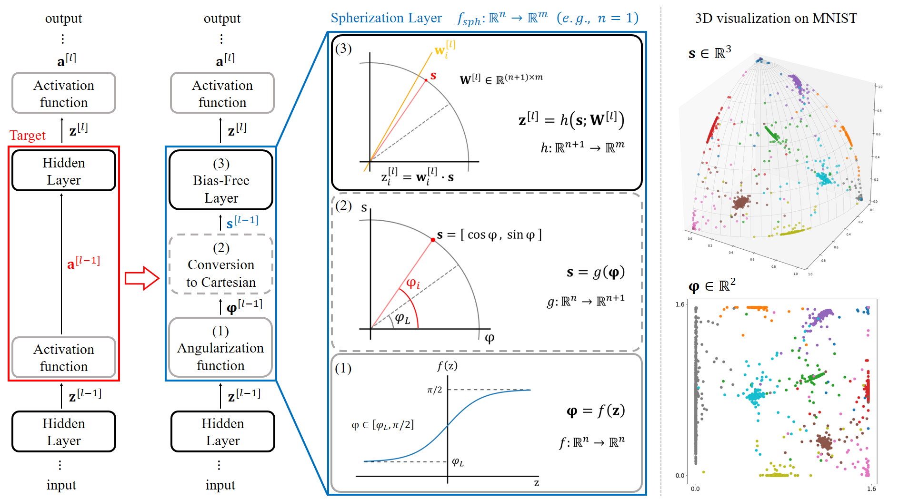

# Spherization Layer: Representation Using Only Angles

This repository is the official implementation of Spherization Layer: Representation Using Only Angles. 




## Experimental Details

### General Settings

We set the below settings for all experiments except word analogy test.

- GPUs: Galaxy 2080TI classic x 1
- CPU cores: 16
- Memory: 128 GB
- NVIDIA Driver: 460.80
- CUDA version: 10.2

### Word Analogy Test

To train language models in this experiment, we set the below setting.

- GPUs: A100 x 1
- CPU cores: 32
- Memory: 115 GB
- NVIDIA Driver: 450.142
- CUDA version: 11.0


## Requirements

To create an environment:

```setup
conda create -n myenv python=3.9.7
conda install pytorch==1.10.1 torchvision==0.11.2 torchaudio==0.10.1 cudatoolkit=10.2 -c pytorch
```

To install requirements:

```setup
pip install numpy==1.21.2 transformers==4.15.0 tensorboardX==2.4.1
```

For word analogy test, you should modify the codes in transformers package to import below classes:

```
from transformers import (
    
    BertIntermediate,
    BertOutput,
    BertLayer,
    BertEncoder,
    BertModel,
    BertForMaskedLM,
    BertPreTrainedModel

    RobertaIntermedate,
    RobertaOutput,
    RobertaLayer,
    RobertaEncoder,
    RobertaModel,
    RobertaForMaskedLM,
    RobertaPreTrainedModel
)
```

## Training and Evaluation

### Functional Correctness Test on a Toy Task

To train and test the model(s) in this task, run this command:

```
python toy_task.py --net {baseline, spheric} --n_epochs 100 \
--lr 0.01 --batch-size 16 \
--scaling 1.0 --radius 1.0 --lrable TF
```

You can train the baseline or spherized model for setting hyperparameter ```net``` as 'baseline' or 'spheric', respectively.


### Retention of Training Ability on Image Classification Benchmarks

To train and test the model(s) in this task, run below commands at each dataset:

#### Retention

```
# MNIST - SimpleFNN
python mnist.py --net {simple_fnn, sph_fnn} --n_epochs 100 \
--lr 0.001 --batch-size 256 --weight-decay 5e-5 \
--scaling 5.0 --radius 5.0 --lrable TF

# MNIST - LeNet5
python mnist.py --net {lenet, sph_cnn} --n_epochs 20 \
--lr 0.001 --batch-size 128 \
--scaling 5.0 --radius 5.0 --lrable TF

# Fashion MNIST - VGG11
python fmnist.py --net {vgg11_bn_one, sph_vgg11s_bn_one} --n_epochs 100 \
--lr 0.01 --batch-size 128 --weight-decay 5e-4 --momentum 0.9 --step 20 --decay-rate 0.5 \
--scaling 5.0 --radius 5.0 --lrable TF

# CIFAR10 - VGG11
python cifar10.py --net {vgg11_bn_w, sph_vgg11s_bn} --n_epochs 300 \
--lr 0.05 --batch-size 128 --weight-decay 5e-4 --momentum 0.9 \
--scaling 5.0 --radius 5.0 --lrable TF

# CIFAR100 - VGG11
python cifar100.py --net {vgg11_bn_w, sph_vgg11s_bn} --n_epochs 200 \
--lr 0.1 --batch-size 128 --weight-decay 5e-4 --momentum 0.9 --decay-rate 0.2 \
--scaling 5.0 --radius 5.0 --lrable TF
```

#### Network Width and Depth

```
# Width - VGG11 (C)
python cifar100.py --net {vgg11_bn_w, sph_vgg11s_bn} --n_epochs 200 \
--lr 0.1 --batch-size 128 --weight-decay 5e-4 --momentum 0.9 --decay-rate 0.2 \
--width {A, B, C, D, E} \
--scaling 5.0 --radius 5.0 --lrable TF

# Depth - VGG{11, 16, 19}
python cifar100.py --net {vgg11_bn_w, vgg16_bn_w, vgg19_bn_w, sph_vgg11s_bn, sph_vgg16s_bn, sph_vgg19s_bn} --n_epochs 200 \
--lr 0.1 --batch-size 128 --weight-decay 5e-4 --momentum 0.9 --decay-rate 0.2 \
--scaling 5.0 --radius 5.0 --lrable TF
```


### Downstream Task: Visualization

```
# Original 2D and 3D
python mnist_vis3d.py --net {simple_cnn_2d, simple_cnn_3d} --n_epochs 20 \
--lr 0.001 --batch-size 64

# Spherization 3D
python mnist_vis3d.py --net {sph_cnn_3d} --n_epochs 20 \
--lr 0.001 --batch-size 32 \
--scaling 1.0 --radius 1.0 --lrable TF
```


### Downstream Task: Word Analogy Test

Please go to the word analogy test directory.


### Downstream Task: Few-shot Learning

Please go to the fewshot directory.


### Downstream Task: Comparison with Angle-based Approaches

This experiment has been done based on the official implementation of Deep Hyperspherical Learning \[[paper](https://arxiv.org/pdf/1711.03189.pdf), [code](https://github.com/wy1iu/SphereNet)\]. We reproduced the codes about SphereNet from Tensorflow to PyTorch.

To train and test the model(s) in this task, run this command:

```
# base
python comparison_with_angle_based.py --data-dir YOUR/DATA/DIRPATH \
--net hsn_cnn9-s --n_epochs 160 --batch-size 128 \
--lr 1e-3 --weight-decay 5e-4 --norm none --w_norm none

# FC10 - direct projection
python comparison_with_angle_based.py --data-dir YOUR/DATA/DIRPATH \
--net hsn_cnn9-s --n_epochs 160 --batch-size 128 \
--lr 1e-3 --weight-decay 5e-4 --norm {sigmoid, linear, cosine} --w_norm none

# FC10 - indirect projection
python comparison_with_angle_based.py --data-dir YOUR/DATA/DIRPATH \
--net hsn_cnn9-d --n_epochs 160 --batch-size 128 \
--lr 1e-3 --weight-decay 5e-4 --norm none --w_norm {w_sigmoid, w_linear, w_cosine}

# FC10 - proposed
python comparison_with_angle_based.py --data-dir YOUR/DATA/DIRPATH \
--net hsnsph_cnn9-s --n_epochs 160 --batch-size 128 \
--lr 1e-3 --weight-decay 5e-4 --norm none --w_norm none \
--scaling 5.0 --radius 5.0 --lrable TF

# FC256 - direct projection
python comparison_with_angle_based.py --data-dir YOUR/DATA/DIRPATH \
--net hsn_cnn9-d --n_epochs 160 --batch-size 128 \
--lr 1e-3 --weight-decay 5e-4 --norm {sigmoid, linear, cosine} --w_norm none

# FC256 - proposed
python comparison_with_angle_based.py --data-dir YOUR/DATA/DIRPATH \
--net hsnsph_cnn9-d --n_epochs 160 --batch-size 128 \
--lr 1e-3 --weight-decay 5e-4 --norm none --w_norm none \
--scaling 5.0 --radius 5.0 --lrable TF
```

## Results

Our model achieves the following performance on :

#### Retention of Training Ability on Image Classification with Various Datasets and Models

Test Accuracy (%): Mean(Std.)

| Model Name | Dataset | Reprod. |  Spherized |
|:----------:|:-------:|:-------:|:----------:|
| SimpleFNN  | MNIST   | 98.58(0.03) | **98.65(0.04)** |
| LeNet-5    | MNIST   | 99.10(0.05) | **99.14(0.04)** |
| VGG-11     | Fashion MNIST | **94.36(0.06)** | 94.34(0.17) |
| VGG-11     | CIFAR10       | 92.38(0.06) | **92.49(0.11)** |
| VGG-11     | CIFAR100      | 68.42(0.12) | **69.03(0.24)** |

#### Robustness on Network Width and Depth on Image Classification with CIFAR100

Test Accuracy (%): Mean(Std.)

| Model Name | Width   | Reprod. |  Spherized |
|:----------:|:-------:|:-------:|:----------:|
| VGG-11     | 16/32/64/128      | 60.17(0.21) | **60.40(0.35)** |
| VGG-11     | 32/64/128/256     | 64.89(0.38) | **65.38(0.28)** |
| VGG-11     | 64/128/256/512    | 68.42(0.12) | **69.03(0.24)** |
| VGG-11     | 128/256/512/1024  | 70.53(0.35) | **70.89(0.19)** |
| VGG-11     | 256/512/1024/1024 | 71.43(0.22) | **71.94(0.19)** |
| VGG-16     | 64/128/256/512    | 72.51(0.26) | **72.53(0.17)** |
| VGG-19     | 64/128/256/512    | 71.53(0.32) | **72.17(0.33)** |

#### Performance of Angle-Based Operators Applied to Penultimate Layer on CIFAR10

Test Accuracy (%): Mean(Std.)

| Operator   | Tr Acc. | Ts Acc. | # err. | # ovlp. | ratio |
|:----------:|:-------:|:-------:|:------:|:-------:|:-------:|
| Original Conv. | 99.47(0.42) | 92.46(0.10) |    0(  0) |    0(  0) |  0.00(0.00) % |
| Sigmoid        | 81.74(4.48) | 79.03(2.71) | 1097(266) | 5222(391) | 20.75(3.70) % |
| Linear         | 74.71(1.06) | 72.15(0.32) | 1631( 39) | 6849(286) | 23.84(0.63) % |
| Cosine         | 77.41(0.89) | 76.15(0.86) |  776(132) | 3170(330) | 24.39(2.66) % |
| Sigmoid W-Softmax | 98.32(0.07) | 91.51(0.19) |  167(  9) | 7925( 58) |  2.11(0.11) % |
| Linear W-Softmax  | 86.74(4.06) | 82.12(3.82) |  946(374) | 7669( 66) | 12.30(4.84) % |
| Cosine W-Softmax  | 99.66(0.04) | 92.29(0.18) |   80(  5) | 7051(134) |  1.14(0.05) % |
| Spherization | 99.66(0.05) | 92.38(0.14) |    0(  0) |  499(106) |  0.00(0.00) % |

The others are shown in each directory.


## Reference

#### Simple FNN
[A fast learning algorithm for deep belief nets](http://www.cs.toronto.edu/~hinton/absps/ncfast.pdf)

#### LeNet-5
[Gradient-based learning applied to document recognition](http://yann.lecun.com/exdb/publis/pdf/lecun-98.pdf)

#### VGG variants
[Very deep convolutional networks for large-scale image recognition](https://arxiv.org/pdf/1409.1556.pdf)

[vgg-pytorch](https://github.com/pytorch/vision/blob/main/torchvision/models/vgg.py)

#### Word Analogy Test
[BERT is to NLP what AlexNet is to CV: Can Pre-Trained Language Models Identify Analogies?](https://github.com/asahi417/analogy-language-model)

[Huggingface](https://huggingface.co/)

#### Few-shot Learning

[Self-Supervised Learning For Few-shot Image Classification.](https://arxiv.org/abs/1911.06045)

#### Comparison with Angle-based Approaches

[Deep Hyperspherical Learning](https://arxiv.org/pdf/1711.03189.pdf)


## Contributing

All content in this repository is licensed under the MIT license.
