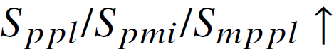

# Word Analogy Test

This experiment has been done based on the official implementation of BERT is to NLP what AlexNet is to CV: Can Pre-Trained Language Models Identify Analogies? \[[paper](https://aclanthology.org/2021.acl-long.280.pdf), [code](https://github.com/asahi417/analogy-language-model)\]

## Requirements

To create an environment, please go to the above github link and do **Get Started** and **Run Experiments**

## Dataset

The datasets used in our experiments can be downloaded (as the same way with reference) from the following link:
- [Analogy Datasets](https://github.com/asahi417/AnalogyTools/releases/download/0.0.0/analogy_test_dataset.zip)

Please see [the Analogy Tool](https://github.com/asahi417/AnalogyTools) for more information about the dataset and baselines.


## Training and Evaluation

### Train Langugage Model

To train the model(s) in this task, run this command:

```
# BERT
python train_{roberta, sphroberta}.py \
--save --ckpt-dir YOUR/CKPT/DIRPATH --ckpt-tag TAG \
--pretrained roberta-large --batch-size 8 \
--scaling 5.0 --radius 5.0 --lrable TF --empty

# RoBERTa
python train_{bert, sphbert}.py \
--save --ckpt-dir YOUR/CKPT/DIRPATH --ckpt-tag TAG \
--pretrained roberta-large --batch-size 8 \
--scaling 5.0 --radius 5.0 --lrable TF --empty
```

If you want to train fine-tuned models, remove the argument ```--empty```.

### Run Word Analogy Test

The following scripts do word analoyg test in the paper.

```
python experiments/experiment_ppl_variants_sph.py \
--ckpt-dir YOUR/CKPT/DIRPATH --ckpt-tag TAG \
--model-tag {bert, sphbert, roberta, sphroberta} \
--export-dir ./experiments_results_ppl_sph
```


## Pre-Trained Models

| Model Name   |  Base |  Spherization |
|:----------:|:-------------:|:-------------:|
| BERT |  [bert-large](https://drive.google.com/file/d/1JVY6CjdlOYgUA3YM8624AkN52PdH_cHW/view?usp=sharing)    | [sphbert-large](https://drive.google.com/file/d/1-nZLGUWQNSLNCmA7Gy37O0qKD192G8_S/view?usp=sharing)
| RoBERTa |  [roberta-large](https://drive.google.com/file/d/1WIhLrPZ97YEdhq4MEsq-ny3nrqoIDlkd/view?usp=sharing)    | [sphroberta-large](https://drive.google.com/file/d/1aMXT6v2ftVFPFbNPgasCfmESc_xHrRXB/view?usp=sharing)

* fine-tuned model

| Model Name   |  Base |  Spherization |
|:----------:|:-------------:|:-------------:|
| BERT |  [bert-large-pretrained](https://drive.google.com/file/d/111UU_pv5APpx-IYc4q5XICQ2HTgxer34/view?usp=sharing)    | [sphbert-large-pretrained](https://drive.google.com/file/d/18VLf8g5I-v4Hb9Aapi53oU-vsOwbuwXA/view?usp=sharing)
| RoBERTa |  [roberta-large-pretrained](https://drive.google.com/file/d/1xJc2vmCdpeE4r-XZYnMmlc7dXZwXWb5c/view?usp=sharing)    | [sphroberta-large-pretrained](https://drive.google.com/file/d/1cnnvVCFPY-UFiq6HJZrJ3AaQCmoRBbsK/view?usp=sharing)


## Results

Our model achieves the following performance on :

* We use the score in the reference: 

#### Performance of BERT
| Model Name |   SAT   |   U2   |   U4   |   Google   |   BATS   |  Avg.  |
|:----------:|:-------:|:------:|:------:|:----------:|:--------:|:------:|
| BERT | **29.4**/28.5/**28.8** | 36.0/36.0/**36.8** | **38.7**/34.7/34.3 | **33.0**/**33.8**/**33.0** | 32.3/**35.0**/33.2 | **33.9**/33.6/**33.2** |
| Spherized BERT | 29.1/**29.4**/27.9 | **37.3**/**39.0**/36.0 | 36.8/**35.9**/**35.4** | 32.4/32.6/32.2 | **34.0**/34.2/**33.8** | **33.9**/**34.2**/33.1 |

#### Performance of RoBERTa

| Model Name |   SAT   |   U2   |   U4   |   Google   |   BATS   |  Avg.  |
|:----------:|:-------:|:------:|:------:|:----------:|:--------:|:------:|
| RoBERTa | **29.4**/**31.2**/29.7 | 35.5/**35.5**/**36.4** | 33.6/**34.3**/**34.5** | 32.8/33.2/30.8 | 30.9/31.6/30.9 | 32.4/33.1/32.5 |
| Spherized RoBERTa | 29.1/29.4/**30.0** | **36.4**/**35.5**/34.2 | **34.0**/**34.3**/33.3 | **34.2**/**33.6**/**32.8** | **35.0**/**33.9**/**34.8** | **33.7**/**33.3**/**33.0** |

#### Performance of BERT (fine-tuned)

| Model Name |   SAT   |   U2   |   U4   |   Google   |   BATS   |  Avg.  |
|:----------:|:-------:|:------:|:------:|:----------:|:--------:|:------:|
| BERT | **29.7**/**32.3**/29.4 | **37.3**/**36.0**/**34.2** | **39.1**/**34.7**/**34.6** | **44.8**/44.4/44.2 | **44.1**/**41.3**/**40.7** | **39.0**/**37.7**/**36.6** |
| Spherized BERT | 29.1/29.1/**30.0** | 36.8/35.1/33.3 | 38.2/32.6/33.3 | 44.6/**45.8**/**44.4** | 40.8/38.8/39.3 | 37.9/36.3/36.1 |

#### Performance of RoBERTa (fine-tuned)

| Model Name |   SAT   |   U2   |   U4   |   Google   |   BATS   |  Avg.  |
|:----------:|:-------:|:------:|:------:|:----------:|:--------:|:------:|
| RoBERTa | 40.7/38.0/40.1 | 43.4/47.8/45.6 | 41.2/43.3/42.1 | 83.0/84.0/83.2 | 68.1/68.5/69.3 | 55.3/56.3/56.0 |
| Spherized RoBERTa | **41.5**/**42.1**/**42.7** | **49.6**/**50.4**/**47.8** | **46.3**/**46.8**/**46.5** | **88.0**/**87.0**/**88.4** | **71.0**/**70.7**/**70.9** | **59.3**/**59.4**/**59.3** |
